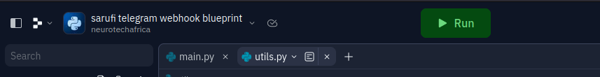

# Sarufi Telegram-Webhook chatbot blueprint

A blueprint for deploying telegram bots made using [Sarufi](https://docs.sarufi.io/). We need a webhook for this task to receive updates from telegram. You can use any of available solutions online. We shall cover setting up webhook using [ngrok](#using-ngrok) and [replit](#using-replit).

## Why use webhook instead of polling?

Using polling may render some delays and consume resorces. So you can use webhook for your chatbot to get rid of delays. Your chatbot will process the requests in time.

## USING NGROK

Make sure you have [ngrok](https://ngrok.com) installed in your local machine.

### Getting ready

- Create Project directory

  Create a project directory `Telegram bot`. In this directory we are going to create a virtual environment to hold our package.

  ```bash
  mkdir 'Telegram bot'
  cd 'Telegram bot'

  ```

- Make virtual environment and install requirements

  Using virtual environment is a good practice, so we are going to create one. You can read more on [why use virtual environment](https://www.freecodecamp.org/news/how-to-setup-virtual-environments-in-python/). We shall install all necessary packages in the environment

  ```bash
  python3 -m venv sarufi
  source sarufi/bin/activate
  ```

- Creating a telegram bot

  To create a chatbot on Telegram, you need to contact the [BotFather](https://telegram.me/BotFather), which is essentially a bot used to create other bots.

  The command you need is /newbot which leads to several steps. Follow the steps then you will have you `bot's token`

### Configuration

In this part, we are going to clone the [Sarufi Telegram Chatbot deployment Blueprint](https://github.com/Neurotech-HQ/sarufi-telegram-webhook-blueprint) and install the packages.

- Clone and install requirements.

  Run the commands below

  ```bash
  git clone https://github.com/Neurotech-HQ/sarufi-telegram-webhook-blueprint.git
  cd sarufi-telegram-webhook-blueprint
  pip3 install -r requirements.txt
  ```

- Getting Sarufi credentials.
  
  To authorize our chabot, we are are going to use authorization keys from sarufi. Log in into your [sarufi account](https://sarufi.io). Go to your Profile on account to get Authorization keys(client ID and client secret)

  

- Environment variables

  After installing packages, we need to configure our credentials. In `telegram-chatbot-blueprint`, create a file(`.env`) to hold environment variables.

  In `.env`, we are going to add the following credetials. To get your public ngrok url read [here](#get-public-url) Using your favourite text editor add the following:-

  ```text
  SARUFI_API_KEY = your API KEY
  SARUFI_BOT_ID= bot id
  TELEGRAM_TOKEN = telegram token
  START_MESSAGE= Hi {name}, Welcome To {bot_name}, How can i help you
  BASE_URL=your ngrok https url
  ```

  **NOTE:** Do not replace `name` na `bot_name` here, they will be be placed automatically in the script

### Launch

#### Get public url

Starting ngrok
  
  ```bash
  ngrok http 8000
  ```

  You will have a public https url indicating that its forwarding to your `localhost:8000`. Copy the url and paste it in `main.py` at line _39_(variable >>**BASE_URL**).

  **NOTE:** The port number(for this case, 8000) matches the port used in `main.py`

#### Running your bot

Run python script
  
  Its the time you have been waiting for. Lets lauch 🚀 our bot. Here depending on your `os`. You can run

  ```python
  python3 main.py
  ```

  or
  
  ```python
  python main.py
  ```
  
  **NOTE:** All operations are done in activated virtual environment for convience

Open your telegram app, search for your bot --> Send it a text. You can see a sample bot [below](#sample-bot-test)

## USING REPLIT

Have an account at [replit](https://replit.com). what you need is to fork the [blueprint repl](https://replit.com/@neurotechafrica/sarufi-telegram-webhook-blueprint) into your replit account.

### Quick configuration

You will have to make little configuration to get you bot up running.

- Creating a telegram bot

  As you already know, we are integrating our sarufi bot with telegram. So you will need to create a telegram bot.

  To create a chatbot on Telegram, you need to contact the [BotFather](https://telegram.me/BotFather), which is essentially a bot used to create other bots.

  The command you need is `/newbot` which leads to the stair-case steps upto having a complete bot. When finish steps, you will `bot's token`. You need the Bot token in the script.

- Getting Sarufi credentials.
  
  To authorize our chabot, we are are going to use authorization keys from sarufi. Log in into your [sarufi account](https://sarufi.io). Go to your Profile on account to get Authorization keys(client ID and client secret)

  

- Environment variables

  In your repl, on the left lower part, `Tool section`. click **secrets** to add your environment variables.

  Add the following secretes. Get your _BASE_URL_ [here](#fire-up-the-bot)

  ```text
  SARUFI_API_KEY = your API KEY
  SARUFI_BOT_ID= bot id
  TELEGRAM_BOT_TOKEN = telegram bot token
  START_MESSAGE= Hi {name}, Welcome To {bot_name}, How can i help you
  BASE_URL= https://<your repl name>.<your replit username>.repl.co
  ```

  **NOTE:** Do not replace `name` na `bot_name` here, they will be programmatically in the script

### Fire up the bot

To launch your bot, you need to add a webhook url, which will be in format of `https://<your repl name>.<your replit username>.co`. In **main.py**, at line _39_ (Variable `BASE_URL`), place your formatted url.

Below you can see where you can find the details in replit. So you will need to replace them with your own info.



**Note** Spaces in the repl name will be replaced with with `-`. Example: `sarufi telegram webhook blueprint` is to be placed as `sarufi-telergam-webhook-blueprint` in the url.

Open your telegram app, search for your bot --> Send it a text. You can see a sample bot [below](#sample-bot-test)

## Sample Bot test

Here is a sample bot deployed in Telegram


## Issues

If you will face any issue, please raise one so as we can fix it as soon as possible

## Contribution

If there is something you would like to contribute, from typos to code to documentation, feel free to do so, `JUST FORK IT`.

## Credits

All the credits to

1. [Jovine](https://github.com/jovyinny)
2. All other contributors
